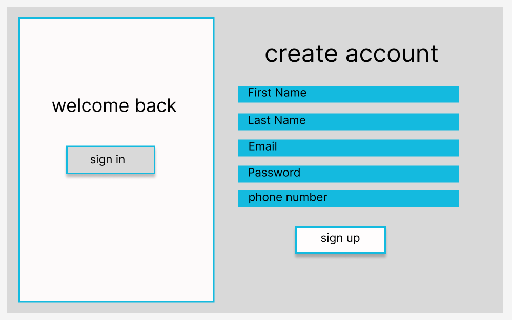
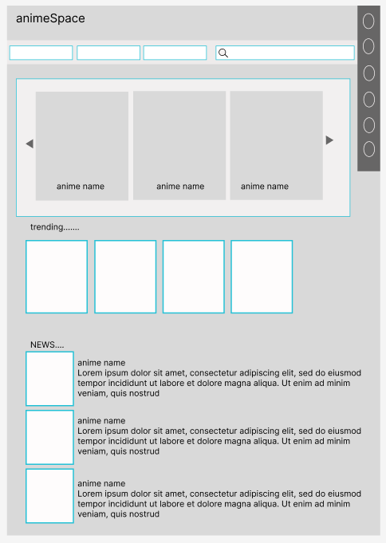
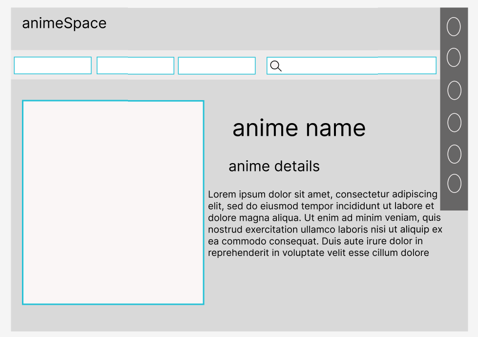
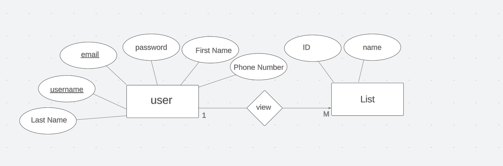

# AniSpace
AniSpace is a MyAnimeList clone project built with React and Node.js with Express. It allows users to track their anime and manga, create lists, and share their thoughts with others.

## Features
..* Track your anime and manga: Keep track of the anime and manga you've watched or read, including your progress, ratings, and reviews.
..* Create lists: Create custom lists to track your anime and manga, such as "Currently Watching," "Completed," and "Plan to Watch."
..* Share your thoughts with others: Share your thoughts on anime and manga with other users, either through reviews or forum posts.
..* Browse anime and manga recommendations: Browse recommendations for anime and manga based on your interests.
..* View anime and manga news: Stay up-to-date on the latest anime and manga news.
..* Search component: Search for anime and manga by title, genre, or rating.
..* Add to favorites list: Add anime and manga to your favorites list for easy access.
..* Sign in: Sign in with your AniList or MAL account.
..* Sign up with OTP: Sign up for a new account using OTP verification.

## Future Features
Add anime to custom lists: Create custom lists to track your anime and manga.
Chat forums: Chat with other users about anime and manga.

## Getting Started
To get started with AniSpace, you will need to have Node.js and NPM installed. Once you have those installed, you can clone the repo and run the following commands:

```npm install
npm start```

This will start the AniSpace app in development mode. You can then open the app in your browser at http://localhost:3000.

## Contributing
Contributions are welcome! If you find any bugs or have any suggestions, please open an issue or submit a pull request.

## Additional Information
..* The app is currently in development, so there may be some bugs.
..* The app is not yet fully featured, but we are working on adding more features in the future.
..* If you have any questions or feedback, please feel free to open an issue or submit a pull request.











## Technologies Used
1. Trello
2. Lucid Chart 
3. VS Code 

## deployed app

[website](https://www.example.com)

## Trello

[trello](https://trello.com/b/HXxLjblQ/project-3)

## Next Step 

1.chat section  
2.custom of wish list 

